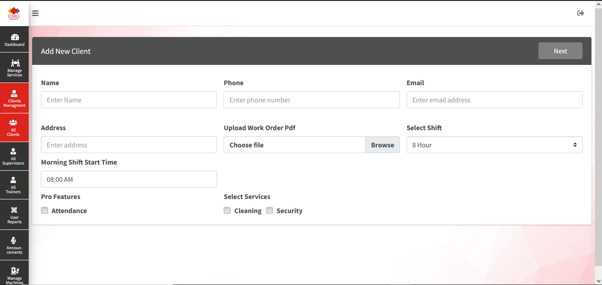

# ChunkyBrains Websites Portfolio

## About

A collection of web development projects delivered for clients across various industries. This portfolio showcases expertise in Laravel, PHP, WordPress, Squarespace, e-commerce development, API integrations, subscription platforms, and custom business solutions.

---

## Core Technologies

- Laravel
- PHP
- WordPress
- Squarespace
- Shopify
- MySQL
- JavaScript
- jQuery
- Bootstrap
- HTML5 / CSS3
- REST APIs
- Razorpay
- Stripe

---

## Services Provided

- Custom Web Application Development
- Business Website Development
- E-commerce Solutions
- Subscription Platforms
- Payment Gateway Integrations
- API Development & Integration
- Website Maintenance & Optimization
- Landing Page Development

---

## Featured Projects

### Laravel Applications

### Project 1: EMG – Facility Management

**Technology Stack:** Laravel, MySQL, REST APIs, Mobile Application Integration

**Website Url:** https://admin.emgindia.in/

**Project Overview**

EMG is a comprehensive facility management platform designed for organizations providing security and cleaning services across commercial buildings, hospitals, offices, and industrial facilities. The system digitizes workforce operations, attendance tracking, incident management, and service reporting through both web and mobile applications.

**Key Features**

* Multi-level role-based access control
* Admin dashboard for workforce and task management
* Client portal for service monitoring and reporting
* Mobile applications for security guards and cleaning staff
* Geo-location based attendance tracking
* QR code verification for task completion
* Incident reporting with image uploads
* Real-time activity monitoring and reporting
* Image-based proof of work validation

**Business Impact**

The platform significantly reduced manual processes, improved operational transparency, enhanced workforce accountability, and streamlined communication between clients and service providers.

**Screenshots**

---

## COCO – Pet Healthcare & Service Marketplace

**Technology Stack:** Laravel, MySQL, Geo-location Services, E-commerce Integration

**Project Overview**

COCO is a multi-service pet care platform that connects pet owners with veterinary doctors, grooming service providers, and pet product vendors. The platform offers healthcare appointment booking, doorstep pet care services, and an integrated pet products marketplace within a unified ecosystem.

**Key Features**

* Multi-user platform architecture
* Veterinary doctor discovery based on location
* Online appointment scheduling system
* Doorstep pet grooming and cleaning bookings
* Pet food and product marketplace
* Vendor registration and management
* Service provider onboarding
* Geo-location based search functionality
* Comprehensive admin management dashboard

**Business Impact**

COCO created a centralized digital ecosystem for pet owners, improving accessibility to healthcare services, grooming solutions, and pet product purchasing through a single platform.

---

## Paint Suvidha – Painting Service Management Platform

**Technology Stack:** Laravel, MySQL, Inventory Management System

**Project Overview**

Paint Suvidha is a business management platform developed for the painting services industry. The solution enables collaboration between administrators, dealers, and painters while streamlining quotation management, inventory distribution, product sales tracking, and commission calculations.

**Key Features**

* Multi-role user management system
* Dealer and painter assignment workflows
* Product inventory management
* Material quotation generation
* Dealer approval process
* Product supply chain tracking
* Commission calculation and reporting
* Painting project workflow automation
* Administrative inventory control

**Business Impact**

The platform improved operational efficiency by digitizing the relationship between painters and dealers, providing transparency in product distribution, commission management, and project execution.

---

## DoctorGoLive – WhatsApp Appointment Automation Platform

**Technology Stack:** Laravel, WhatsApp Integration, QR Code System

**Project Overview**

DoctorGoLive is a healthcare appointment automation platform that leverages WhatsApp to simplify patient appointment scheduling. Each healthcare provider receives a unique QR code that patients can scan to instantly access booking, rescheduling, and appointment management services.

**Key Features**

* WhatsApp-based appointment booking
* Unique QR code generation for doctors
* Doctor management dashboard
* Appointment scheduling and tracking
* Reschedule and cancellation management
* Patient interaction monitoring
* SMS package management system
* Administrative control panel
* Mobile-friendly user experience

**Business Impact**

The platform reduced administrative workload for healthcare providers while providing patients with a familiar and convenient communication channel for managing appointments.

---

## Core Laravel Expertise Demonstrated

* Enterprise Web Applications
* Multi-Tenant Architectures
* Role-Based Access Control (RBAC)
* Appointment & Booking Systems
* Geo-Location Integrations
* QR Code Implementations
* REST API Development
* Mobile App Backend Development
* E-commerce Functionality
* Business Process Automation
* Inventory Management Systems
* Reporting & Analytics Dashboards

---

## Key Achievements

- 50+ Client Projects Delivered
- Laravel & PHP Custom Development
- WordPress & Squarespace Expertise
- Payment Gateway Integrations
- Subscription & SaaS Platforms
- Responsive and SEO-Friendly Development

---

## Contact

**ChunkyBrains**

Email: chunkybrains123@gmail.com

Website: https://www.chunkybrains.com/
