# ChunkyBrains Websites Portfolio

## About

A collection of web development projects delivered for clients across various industries. This portfolio showcases expertise in Laravel, PHP, WordPress, Squarespace, e-commerce development, API integrations, subscription platforms, and custom business solutions.

---

## Core Technologies

- Laravel
- PHP
- WordPress
- Squarespace
- Shopify
- MySQL
- JavaScript
- jQuery
- Bootstrap
- HTML5 / CSS3
- REST APIs
- Razorpay
- Stripe

---

## Services Provided

- Custom Web Application Development
- Business Website Development
- E-commerce Solutions
- Subscription Platforms
- Payment Gateway Integrations
- API Development & Integration
- Website Maintenance & Optimization
- Landing Page Development

---

## Featured Projects

### Laravel Applications

### Project 1: EMG – Facility Management

**Technology Stack:** Laravel, MySQL, REST APIs, Mobile Application Integration

**Website Url:** https://admin.emgindia.in/

**Project Overview**

EMG is a comprehensive facility management platform designed for organizations providing security and cleaning services across commercial buildings, hospitals, offices, and industrial facilities. The system digitizes workforce operations, attendance tracking, incident management, and service reporting through both web and mobile applications.

**Key Features**

* Multi-level role-based access control
* Admin dashboard for workforce and task management
* Client portal for service monitoring and reporting
* Mobile applications for security guards and cleaning staff
* Geo-location based attendance tracking
* QR code verification for task completion
* Incident reporting with image uploads
* Real-time activity monitoring and reporting
* Image-based proof of work validation

**Business Impact**

The platform significantly reduced manual processes, improved operational transparency, enhanced workforce accountability, and streamlined communication between clients and service providers.

**Screenshots**

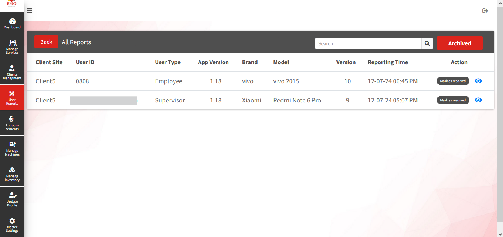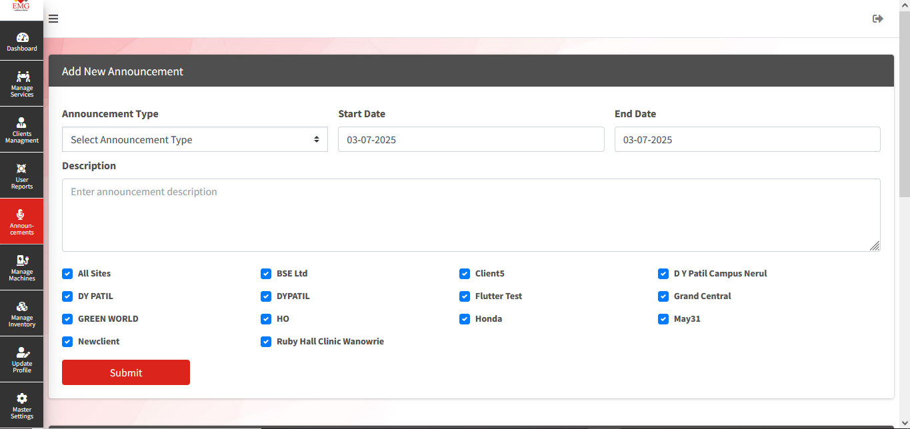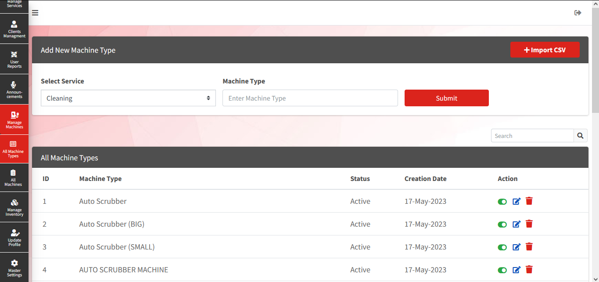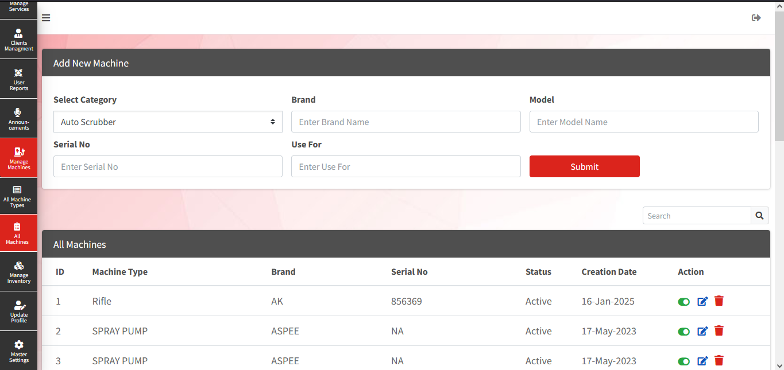

---

## Project 2: COCO – Pet Healthcare & Service Marketplace

**Technology Stack:** Laravel, MySQL, Geo-location Services, E-commerce Integration

**Website Url:** https://coco.brickandwallsinc.com

**Project Overview**

COCO is a multi-service pet care platform that connects pet owners with veterinary doctors, grooming service providers, and pet product vendors. The platform offers healthcare appointment booking, doorstep pet care services, and an integrated pet products marketplace within a unified ecosystem.

**Key Features**

* Multi-user platform architecture
* Veterinary doctor discovery based on location
* Online appointment scheduling system
* Doorstep pet grooming and cleaning bookings
* Pet food and product marketplace
* Vendor registration and management
* Service provider onboarding
* Geo-location based search functionality
* Comprehensive admin management dashboard

**Business Impact**

COCO created a centralized digital ecosystem for pet owners, improving accessibility to healthcare services, grooming solutions, and pet product purchasing through a single platform.

**Screenshots**

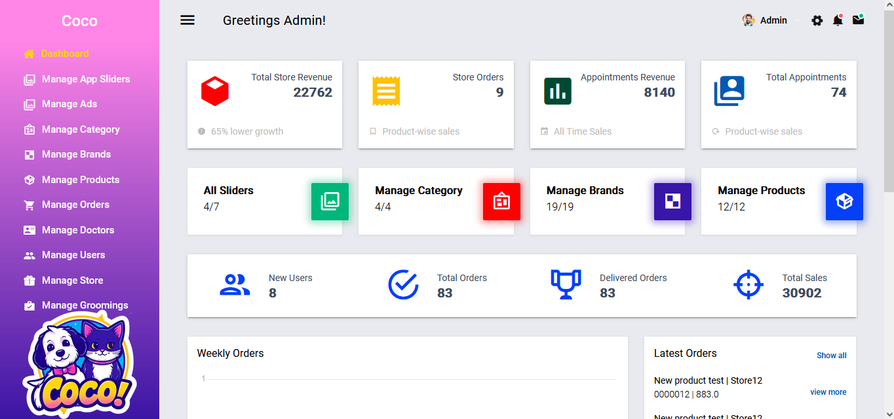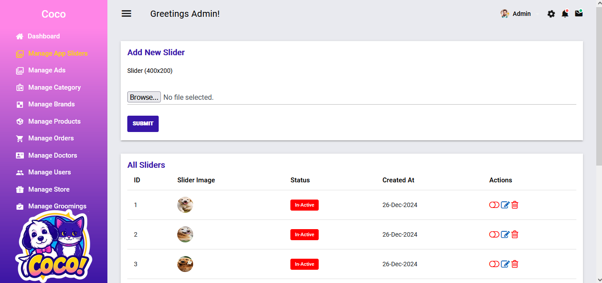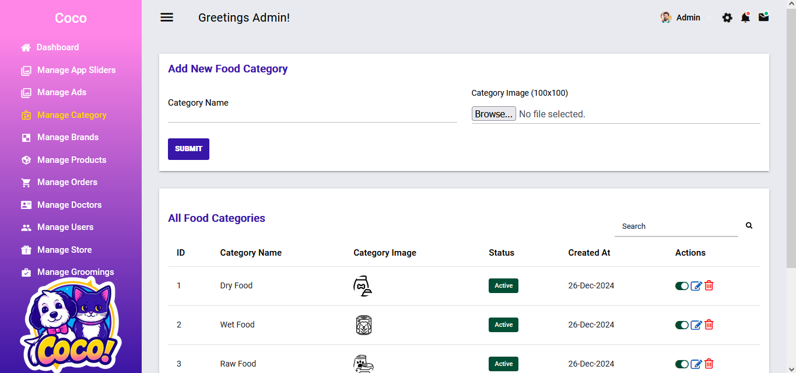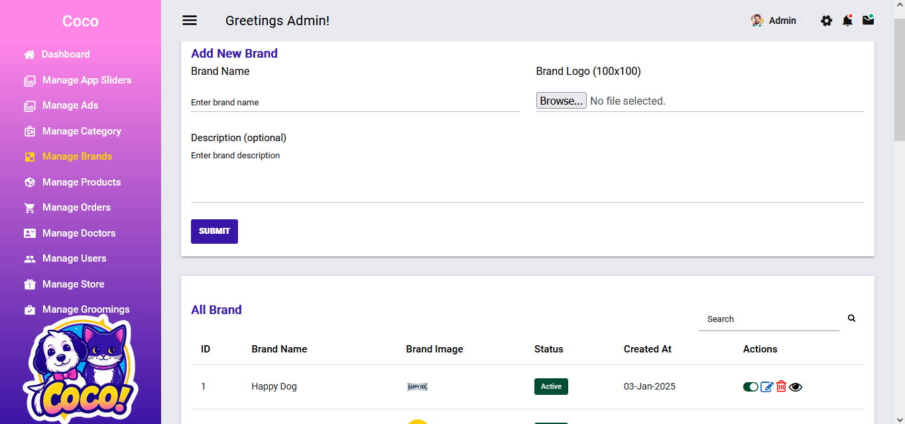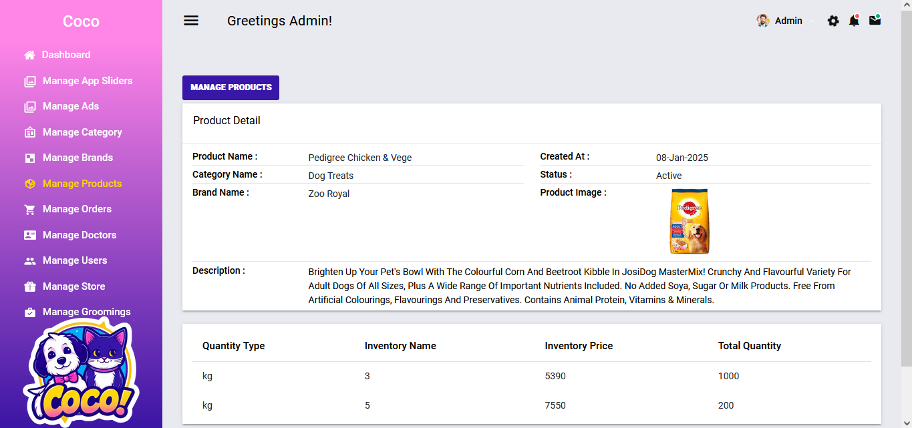

---

## Project 3: Paint Suvidha – Painting Service Management Platform

**Technology Stack:** Laravel, MySQL, Inventory Management System

**Website Url:** https://brickandwallsinc.com/paintsuvidha/public/

**Project Overview**

Paint Suvidha is a business management platform developed for the painting services industry. The solution enables collaboration between administrators, dealers, and painters while streamlining quotation management, inventory distribution, product sales tracking, and commission calculations.

**Key Features**

* Multi-role user management system
* Dealer and painter assignment workflows
* Product inventory management
* Material quotation generation
* Dealer approval process
* Product supply chain tracking
* Commission calculation and reporting
* Painting project workflow automation
* Administrative inventory control

**Business Impact**

The platform improved operational efficiency by digitizing the relationship between painters and dealers, providing transparency in product distribution, commission management, and project execution.

**Screenshots**

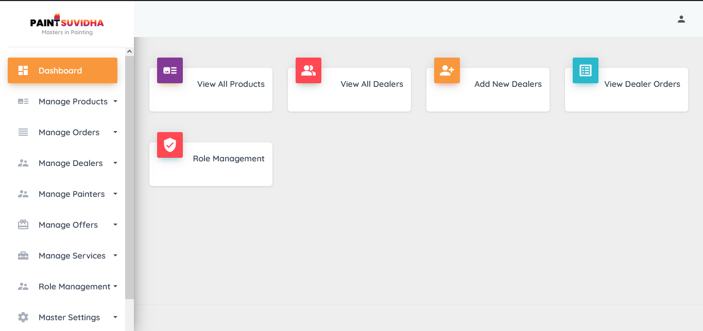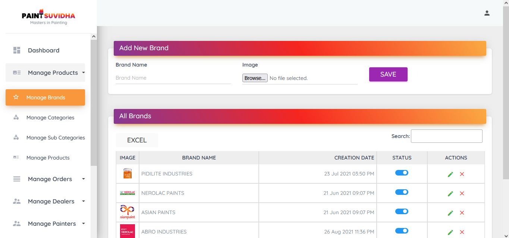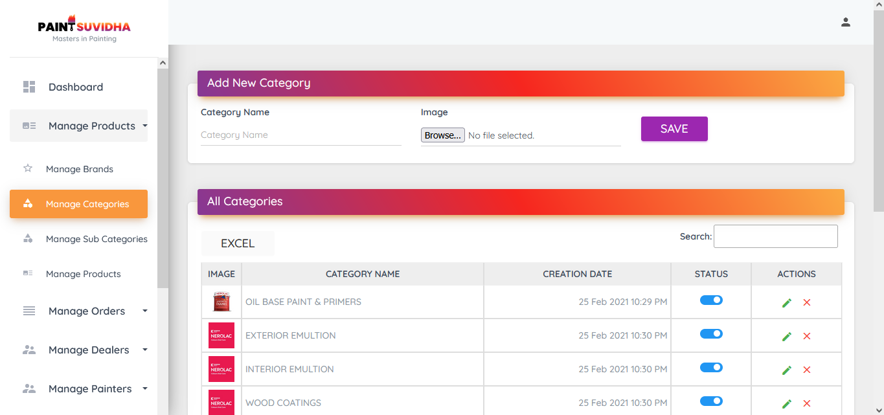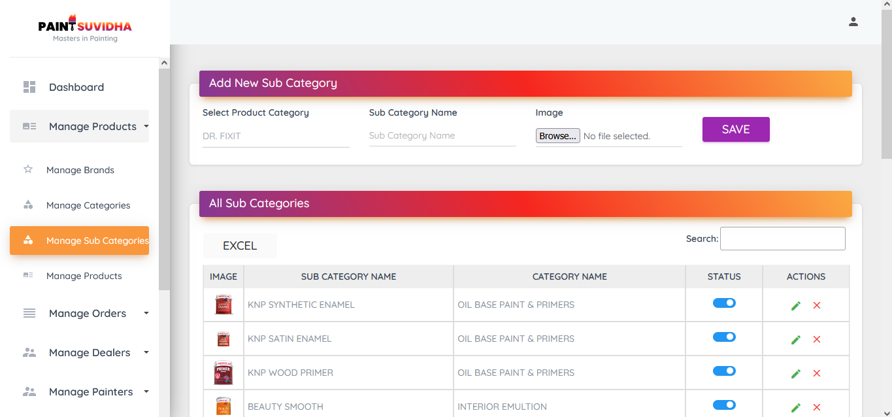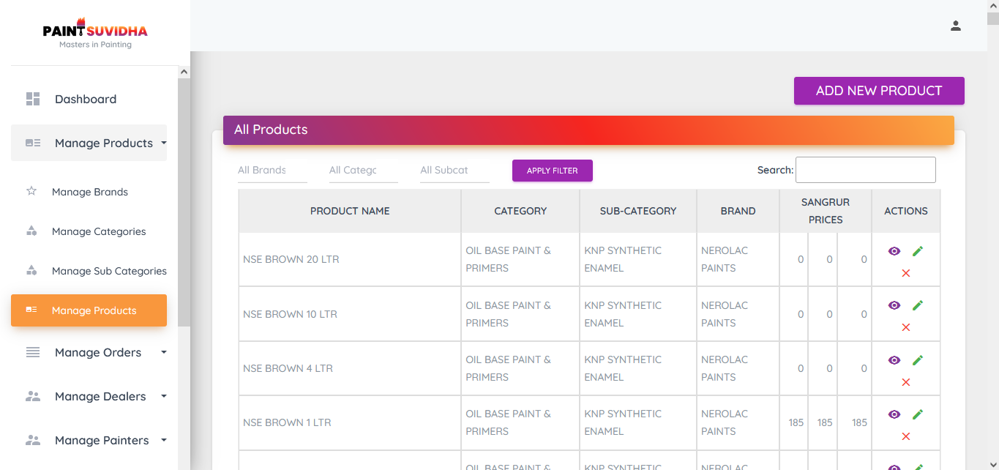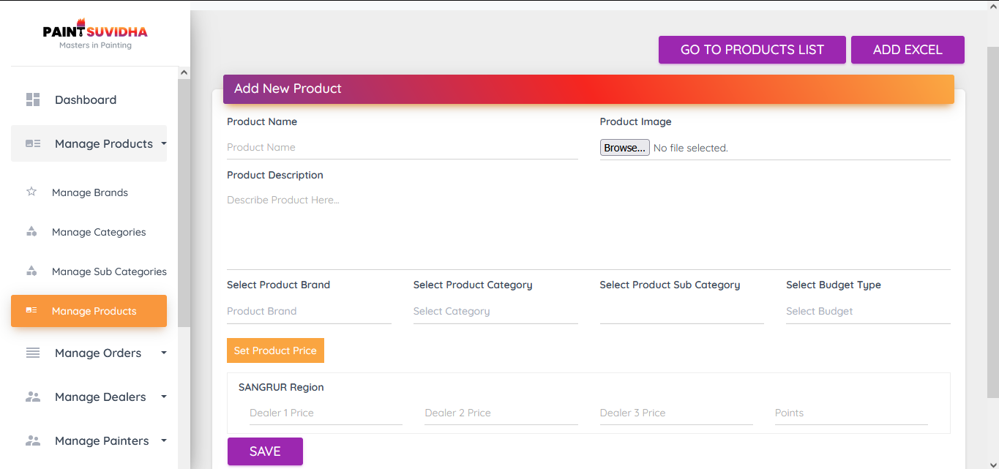

---

## Project 4: Tatkal Doctor – WhatsApp Appointment Automation Platform

**Technology Stack:** Laravel, WhatsApp Integration, QR Code System 

**Website Url:** https://www.tatkaldoctor.com/

**Project Overview**

Tatkal Doctor is a healthcare appointment automation platform that leverages WhatsApp to simplify patient appointment scheduling. Each healthcare provider receives a unique QR code that patients can scan to instantly access booking, rescheduling, and appointment management services.

**Key Features**

* WhatsApp-based appointment booking
* Unique QR code generation for doctors
* Doctor management dashboard
* Appointment scheduling and tracking
* Reschedule and cancellation management
* Patient interaction monitoring
* SMS package management system
* Administrative control panel
* Mobile-friendly user experience

**Business Impact**

The platform reduced administrative workload for healthcare providers while providing patients with a familiar and convenient communication channel for managing appointments.

**Screenshots**

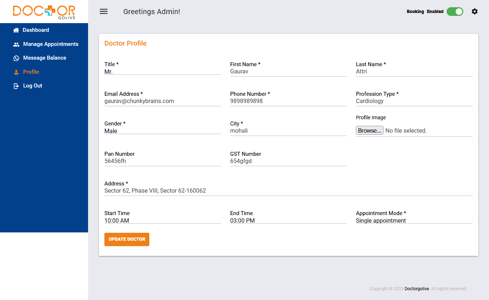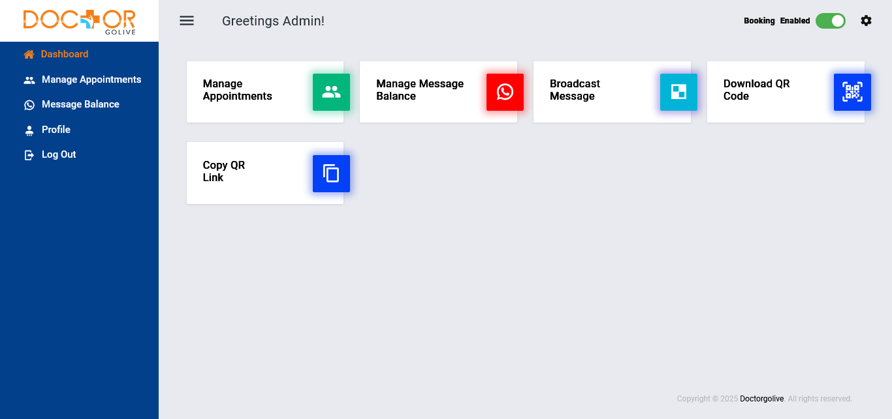

## Core Laravel Expertise Demonstrated

* Enterprise Web Applications
* Multi-Tenant Architectures
* Role-Based Access Control (RBAC)
* Appointment & Booking Systems
* Geo-Location Integrations
* QR Code Implementations
* REST API Development
* Mobile App Backend Development
* E-commerce Functionality
* Business Process Automation
* Inventory Management Systems
* Reporting & Analytics Dashboards

---

### WordPress Websites

### Project 1: amasol – IT Consultancy & Managed Services Platform

**Website:** https://amasol.com/

**Technology Stack:** WordPress, HTML, CSS, JavaScript

### Project Overview

amasol is a leading IT consultancy and managed service provider specializing in monitoring solutions focused on Usability, Observability, Detectability, and IT Reliability. The website was developed to present complex technical services through a clean, modern, and highly accessible digital experience.

### Key Features

* Modern corporate website design
* Dedicated service sections for IT monitoring solutions
* Responsive user experience across all devices
* SEO-optimized architecture
* Performance-focused implementation
* Structured content strategy
* Accessibility-focused design

### Business Impact

The platform serves as a professional digital presence that clearly communicates amasol's expertise while helping prospective clients understand their service offerings and technical capabilities.

**Screenshots**

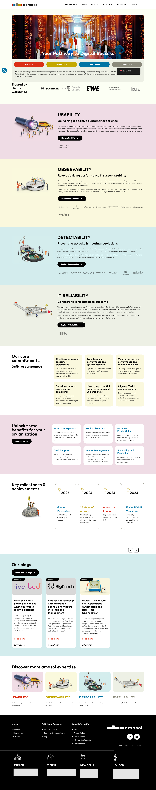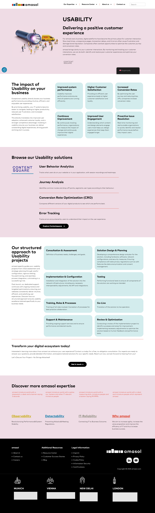

---

### Project 2: 3Sixty Health – Healthcare Administration Website

**Website:** https://3sixtyhealth.co.za/

**Technology Stack:** WordPress, HTML, CSS, JavaScript

### Project Overview

3Sixty Health is a healthcare administration organization specializing in Membership Administration and Managed Healthcare services. The website was designed to establish credibility, clearly communicate service offerings, and provide stakeholders with easy access to healthcare-related information.

### Key Features

* Professional healthcare-focused design
* Fully responsive user interface
* Structured service presentation
* Easy-to-manage content management system
* Clear navigation architecture
* Mobile-friendly experience
* SEO-friendly implementation

### Business Impact

The website strengthens the organization's digital presence while providing members and stakeholders with clear access to healthcare administration services and resources.

**Screenshots**

<table>
<tr>
<td valign="top">
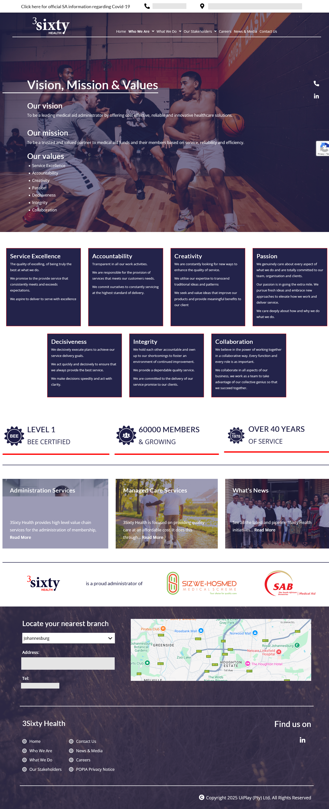
</td>

<td valign="top">
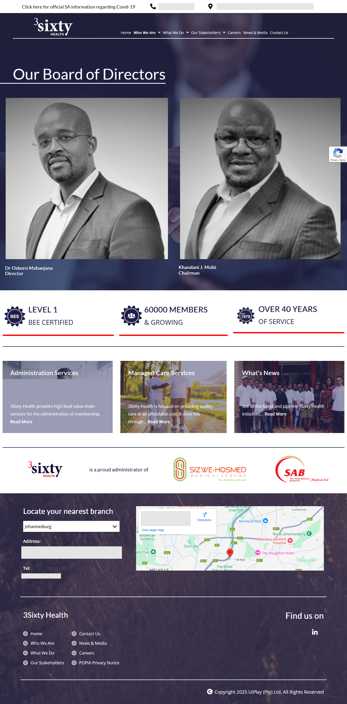
</td>
</tr>

<tr>
<td valign="top">
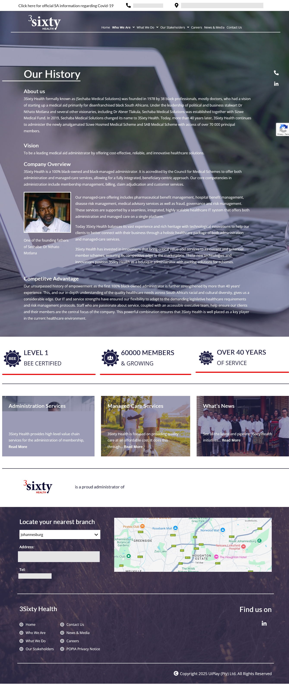
</td>

<td valign="top">
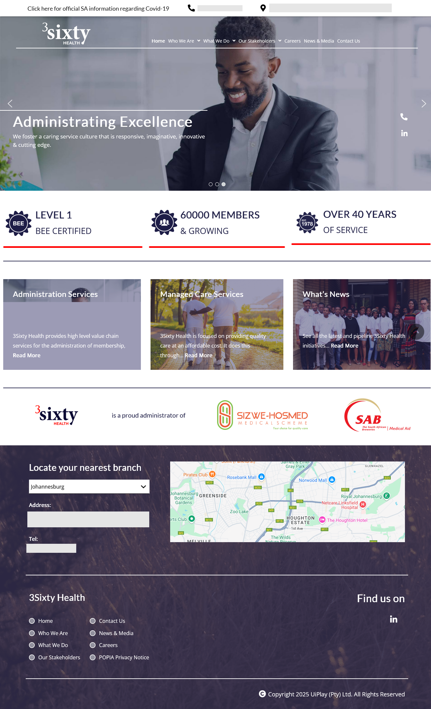
</td>
</tr>
</table>

---

### Project 3: Aktina – Medical Equipment Product Catalog

**Website:** https://www.aktina.com/

**Technology Stack:** WordPress, Product Catalog Management

### Project Overview

Aktina is a medical equipment supplier providing advanced healthcare products to hospitals, clinics, and healthcare professionals. The website functions as a digital catalog, enabling visitors to browse product information, submit inquiries, and stay updated with industry news.

### Key Features

* Medical equipment product catalog
* Category-based product organization
* Product inquiry forms
* Blog and news management
* SEO-optimized architecture
* Professional healthcare UI
* Responsive design

### Business Impact

The platform enables healthcare providers to easily discover products, access detailed specifications, and initiate purchase inquiries through a streamlined user experience.

**Screenshots**

---

### Project 4: DITEK Surge Protection – Electronic Safety Solutions Website

**Website:** https://www.diteksurgeprotection.com

**Technology Stack:** WordPress, Content Management System

### Project Overview

DITEK Surge Protection is a leading provider of electrical and electronic surge protection solutions. The website was developed as both an educational resource and product showcase platform to help customers understand the importance of surge protection.

### Key Features

* Product showcase and categorization
* Educational content sections
* Resource and blog management
* Customer inquiry generation
* Responsive website design
* SEO-focused architecture
* Clear conversion pathways

### Business Impact

The website improves product visibility while educating customers about surge protection solutions and generating qualified business inquiries.

**Screenshots**

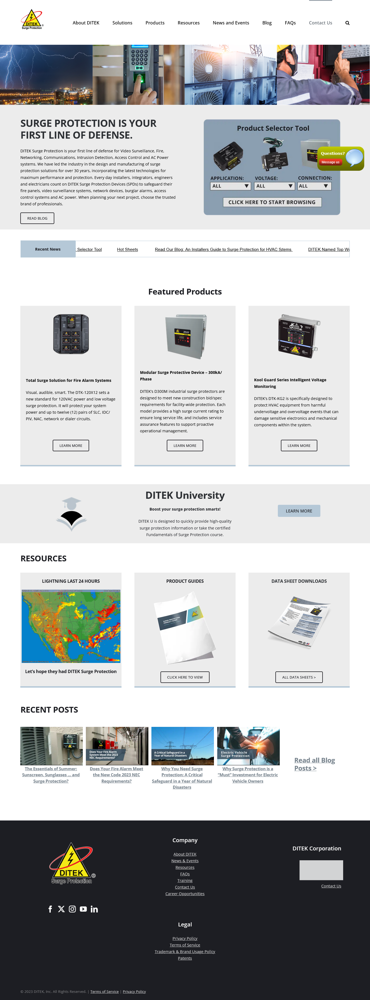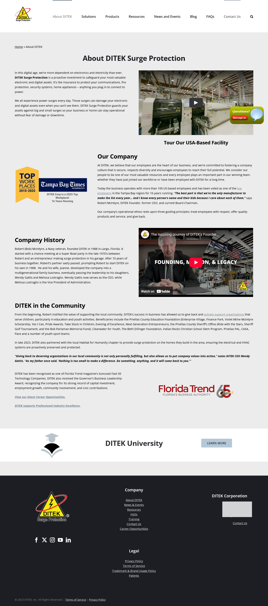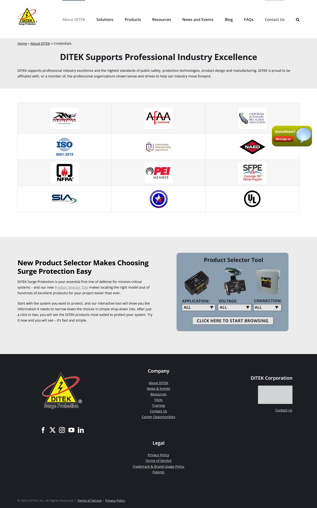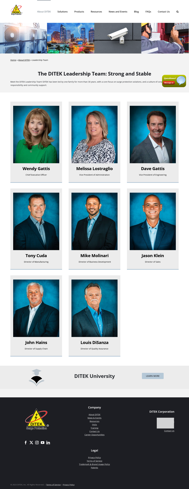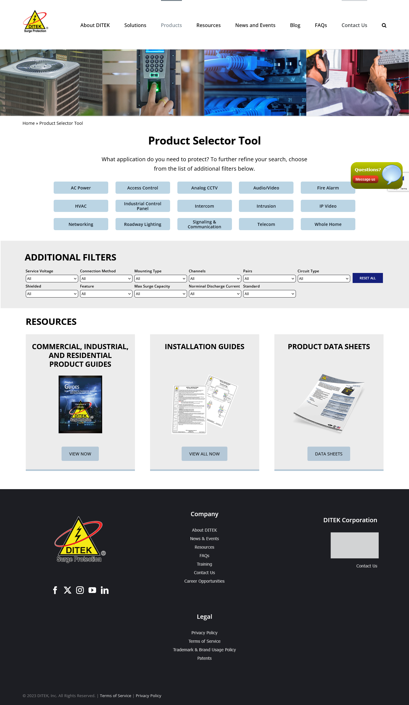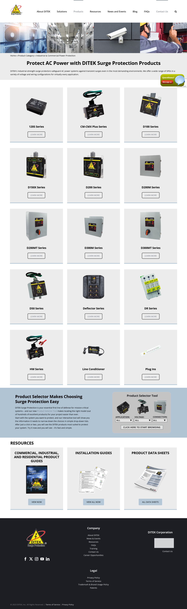

---

### Project 5: OKAYGROWTH – Growth Strategy & AI Solutions Platform

**Website:** https://okaygrowth.com

**Technology Stack:** WordPress, Marketing Website

### Project Overview

OKAYGROWTH is a business consulting platform helping organizations achieve predictable growth through data-driven strategies, AI-powered systems, and go-to-market planning. The website was developed to showcase services, expertise, and growth methodologies.

### Key Features

* AI and business growth focused website
* Service-oriented landing pages
* Lead generation optimization
* Educational blog and resources
* Responsive design
* Strong call-to-action structure
* SEO and performance optimization

### Business Impact

The platform positions OKAYGROWTH as a trusted growth partner while generating leads through clear messaging, educational content, and strategic conversion pathways.

**Screenshots**

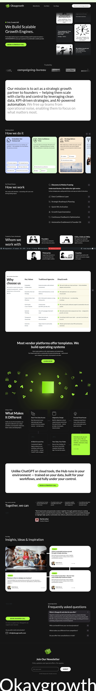

---

## WordPress Expertise Demonstrated

* Corporate Websites
* Healthcare Websites
* Product Catalog Platforms
* IT Consultancy Websites
* B2B Service Websites
* Lead Generation Websites
* SEO Optimization
* Responsive Web Development
* Performance Optimization
* Custom WordPress Development
* Content Management Solutions
* UI/UX Enhancement

---

## Key Achievements

- 200+ Client Projects Delivered
- Laravel & PHP Custom Development
- WordPress & Squarespace Expertise
- Payment Gateway Integrations
- Subscription & SaaS Platforms
- Responsive and SEO-Friendly Development

---

## Contact

**ChunkyBrains**

Email: chunkybrains123@gmail.com

Website: https://www.chunkybrains.com/
